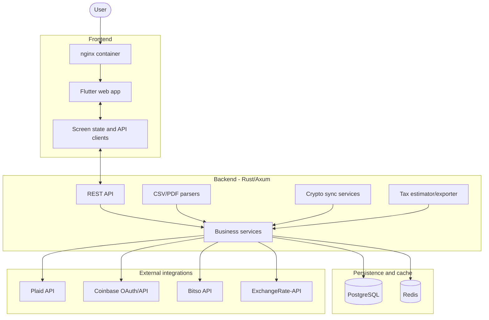

# System Architecture

Patrimonio uses a Flutter client (web and a native Android APK), a Rust/Axum API, PostgreSQL as the source of truth, and Redis for cached exchange-rate and short-lived integration data.

## High-Level Diagram

## Data Flow

### Account Synchronization

Plaid sync routes fetch US account balances, transactions, and holdings. The backend normalizes provider payloads into local `accounts`, `transactions`, `holdings`, and `balance_snapshots` rows.

### Crypto Synchronization

Coinbase uses OAuth with refreshable encrypted tokens. Bitso uses read-only API keys with HMAC signing. Crypto balances are valued through ticker data and stored as holdings and account balances.

### Manual Imports

Nu Mexico, Banamex, and Cetesdirecto statements are uploaded through the app. Parser services extract transactions and balances from CSV/PDF files, then write normalized records to the same tables used by automated sync.

### Net Worth and Tax Calculation

Dashboard routes aggregate account balances, holdings, transaction history, and exchange rates. Tax routes estimate US federal and Mexico ISR exposure and export taxable activity as CSV/PDF reports.

## Component Overview

| Component | Responsibility |
|-----------|----------------|
| Rust API | Request handling, validation, integrations, SQL queries, and exports. |
| Flutter app | Dashboard, management workflows, tax views, imports, and responsive navigation. |
| PostgreSQL | Source of truth for institutions, accounts, transactions, holdings, snapshots, rates, and sync cursors. |
| Redis | Cache for FX data and short-lived service state. |
| Docker Compose | Local orchestration for frontend, API, database, and cache. |
