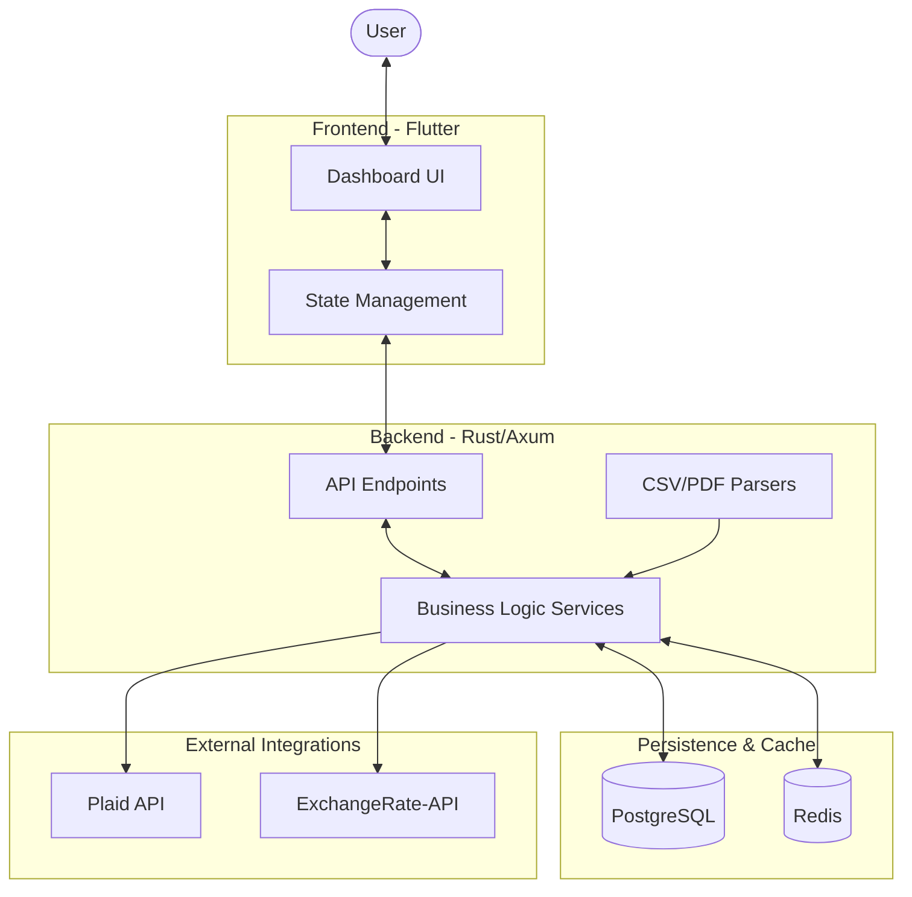

# System Architecture

Patrimonio follows a modern client-server architecture with a heavy emphasis on data integrity and real-time exchange rate accuracy.

## High-Level Diagram

## Data Flow

### 1. Account Synchronization (US)
The backend service periodically calls the Plaid API to fetch updated balances and transactions. The raw data is normalized and stored in PostgreSQL.

### 2. Manual Imports (Mexico)
Users can upload statement files (PDF/CSV) via the frontend. The backend's parser service extracts transaction data, calculates balances, and updates the local records.

### 3. Net Worth Calculation
The system aggregates balances across all accounts. For multi-currency tracking, it fetches the latest FX rates (cached in Redis) and calculates the total in the user's preferred currency.

## Component Overview

| Component | Responsibility |
| :--- | :--- |
| **Rust API** | High-performance request handling, SQL query execution, and security. |
| **Flutter App** | Cross-platform rendering with a focus on visual excellence and responsiveness. |
| **PostgreSQL** | Primary source of truth for all financial records and snapshots. |
| **Redis** | Fast caching for API tokens and real-time exchange rates. |
