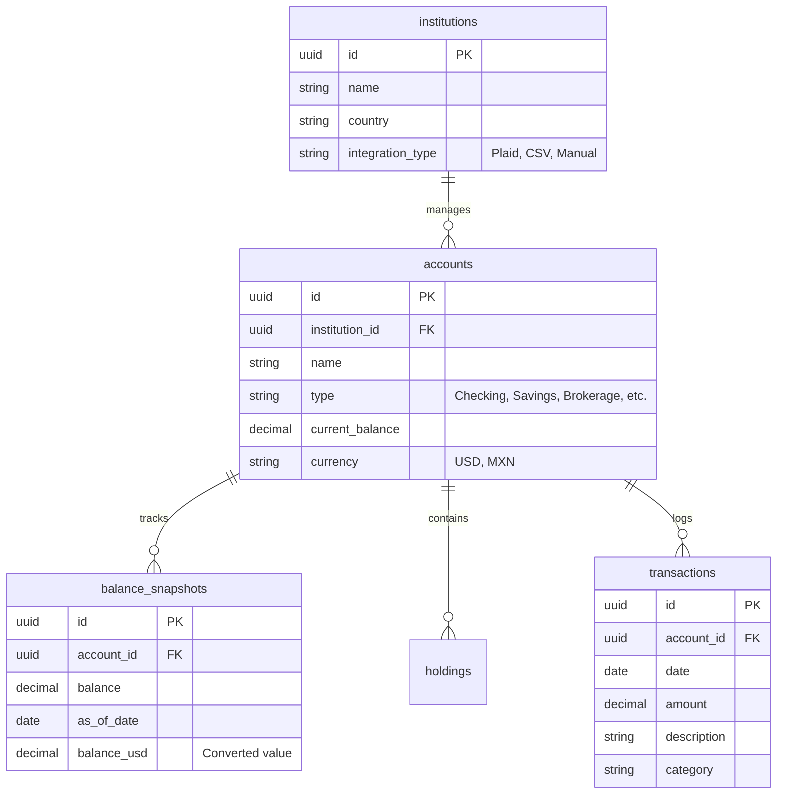

# Database Schema

Patrimonio uses **PostgreSQL 17** as its primary relational database. Data integrity is enforced through strong types, foreign keys, and constraints.

## Entity Relationship Diagram

## Tables Overview

### `institutions`
Stores metadata for banks and financial entities. Includes Plaid-specific IDs for US banks.

### `accounts`
The core entity. Links to an institution and tracks the current "live" balance.

### `balance_snapshots`
Critical for historical net worth charts. A daily snapshot is taken for every account to track growth over time.

### `holdings`
Stores individual stocks, ETFs, or crypto assets within brokerage accounts.

### `exchange_rates`
A history of USD/MXN pairs to allow historical conversion of total net worth.

## Migrations
Migrations are managed via `sqlx` and run automatically on backend startup. They are located in `backend/migrations/`.
