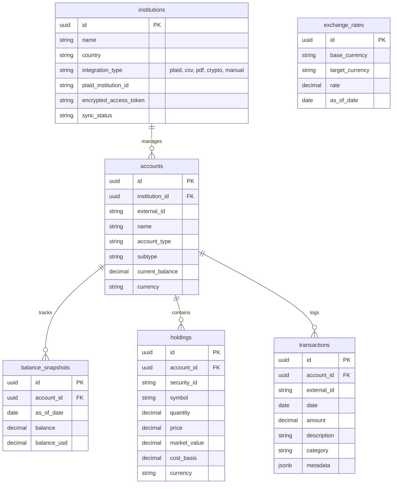

# Database Schema

Patrimonio uses PostgreSQL 17 as its primary relational database. Migrations are managed with SQLx and run automatically on backend startup.

## Entity Relationship Diagram

## Tables Overview

### `institutions`

Stores banks, brokerages, crypto exchanges, and manual/import sources. Integration metadata includes provider identifiers and encrypted credentials where needed.

### `accounts`

Represents checking, savings, credit, brokerage, retirement, HSA, crypto, Cetes, and manual accounts. `external_id` links records back to a provider when available.

### `transactions`

Stores normalized account activity from Plaid, imports, and manual sources. Provider IDs prevent duplicate imports and support incremental sync.

### `holdings`

Stores securities and crypto positions, including quantity, market value, price, and cost-basis fields used by portfolio and tax views.

### `balance_snapshots`

Keeps dated balance history for net worth charts and trend analysis.

### `exchange_rates`

Stores USD/MXN rates for current and historical conversion.

### Sync metadata

The schema also tracks provider sync cursors, including Plaid transaction cursors, so incremental sync can resume without replaying full histories.

## Migrations

Migration files live in `backend/migrations/`. Start the API or run the Compose stack to apply pending migrations.
